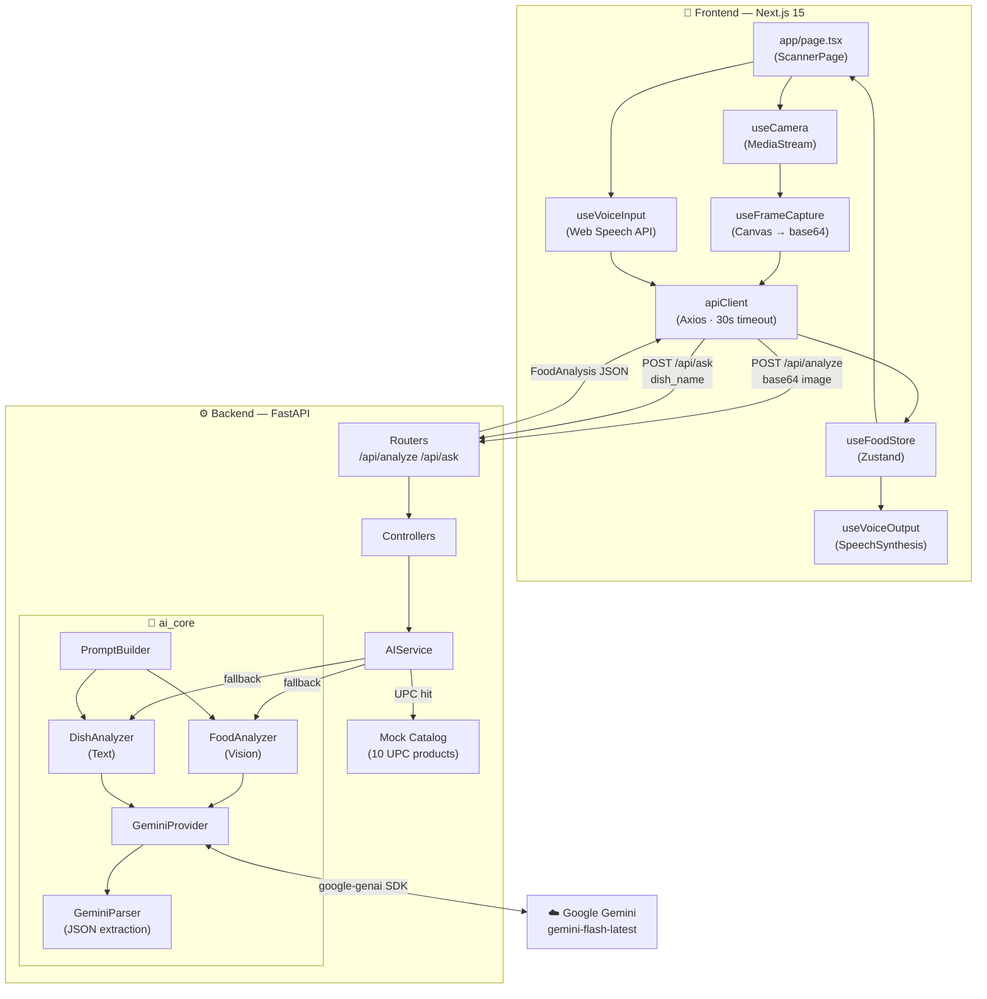

<div align="center">

# 🍎 FoodLens AI

**Point your camera at any food — get instant nutrition, ingredients & allergen info powered by Google Gemini Vision.**

[](https://fastapi.tiangolo.com)
[](https://nextjs.org)
[](https://www.typescriptlang.org)
[](https://ai.google.dev)
[](LICENSE)

<br/>

> A full-stack, mobile-first food intelligence app — scan a dish, speak its name, or type it in and get a complete nutritional breakdown in seconds.

</div>

---

## ✨ What It Does

| Mode | How | What you get |
|------|-----|--------------|
| 📷 **Camera Scan** | Tap capture on the live camera feed | Dish name, confidence score, full nutrition |
| 🎤 **Voice Scan** | Speak a dish name | Hands-free lookup + text-to-speech result |
| 💬 **Ask AI** | Type any dish name | Bottom-sheet result with ingredients, macros & allergens |

---

## 🏗️ Architecture



### Data Flow — Scan Mode

```
Camera Feed → tap Capture → useFrameCapture (canvas.toDataURL → strip prefix)
    → POST /api/analyze { base64_image }
        → GeminiProvider.generate_with_image(prompt, bytes)
            → Gemini Vision API → raw JSON
                → GeminiParser → FoodAnalysis
    → useFoodStore.setResult() → LiveOverlay renders on camera feed
```

### Data Flow — Ask / Voice Mode

```
Text input / Speech Recognition → dish_name string
    → POST /api/ask { dish_name }
        → Mock catalog fuzzy match (instant, no API call)
          OR DishAnalyzer → Gemini text → FoodAnalysis
    → useFoodStore.setResult() → ResultPanel bottom sheet
                               → SpeechSynthesis (voice mode)
```

---

## 🛠️ Tech Stack

### Backend
| Layer | Tech |
|-------|------|
| Framework | [FastAPI](https://fastapi.tiangolo.com) + Uvicorn |
| AI | Google Gemini `gemini-flash-latest` via `google-genai` SDK |
| Validation | Pydantic v2 + pydantic-settings |
| Config | python-dotenv |

### Frontend
| Layer | Tech |
|-------|------|
| Framework | Next.js 15 (App Router) + React 19 |
| Language | TypeScript 5 (strict) |
| Styling | Tailwind CSS 4 + shadcn/ui (Radix primitives) |
| State | Zustand |
| Animations | Framer Motion |
| HTTP | Axios |
| Voice | Web Speech API (native browser — no backend) |

---

## 🚀 Getting Started

### Prerequisites
- Python 3.11+
- Node.js 18+ / pnpm
- A [Google Gemini API key](https://ai.google.dev) (free tier available)

### 1 — Backend

```bash
cd backend
python -m venv venv
source venv/bin/activate        # Windows: venv\Scripts\activate
pip install -r requirements.txt

cp .env.example .env
# → add your GEMINI_API_KEY to .env

uvicorn main:app --reload --port 8000
```

Interactive API docs: [http://localhost:8000/docs](http://localhost:8000/docs)

### 2 — Frontend

```bash
cd frontend
pnpm install
# NEXT_PUBLIC_API_URL defaults to http://localhost:8000 — no extra config needed

pnpm dev
```

App: [http://localhost:3000](http://localhost:3000)

---

## 📡 API Reference

### `POST /api/analyze` — Analyze a food image

```json
// Request
{ "base64_image": "<base64 JPEG string — no data URI prefix>" }
```

### `POST /api/ask` — Look up a dish by name

```json
// Request
{ "dish_name": "Butter Chicken" }
```

### Response — both endpoints return `FoodAnalysis`

```json
{
  "dish_name": "Butter Chicken",
  "ingredients": ["chicken", "butter", "tomato", "cream", "garam masala"],
  "nutrition": {
    "calories": 450,
    "protein_g": 28,
    "carbs_g": 14,
    "fat_g": 30,
    "fiber_g": 2,
    "sugar_g": 8,
    "sodium_mg": 620
  },
  "allergens": ["dairy"],
  "confidence": "high"
}
```

> **Allergen values:** `dairy` · `nuts` · `gluten` · `soy` · `eggs`  
> **Confidence values:** `high` · `medium` · `low`

### `GET /health`

```json
{ "status": "ok", "service": "FoodLens AI Backend" }
```

---

## 📁 Project Structure

```
foodlens-ai/
├── backend/
│   ├── main.py                     # FastAPI app + CORS
│   ├── requirements.txt
│   ├── .env.example
│   ├── routers/
│   │   ├── analyze.py              # POST /api/analyze
│   │   ├── ask.py                  # POST /api/ask
│   │   └── health.py               # GET /health
│   ├── controllers/
│   │   ├── analyze_controller.py
│   │   └── ask_controller.py
│   ├── services/
│   │   └── ai_service.py           # Orchestrates analyzers
│   ├── ai_core/
│   │   ├── providers/
│   │   │   └── gemini_provider.py  # Gemini SDK wrapper
│   │   ├── analyzers/
│   │   │   ├── food_analyzer.py    # Vision-based analysis
│   │   │   └── dish_analyzer.py    # Text-based analysis
│   │   ├── prompts/
│   │   │   ├── food_prompt.py
│   │   │   ├── dish_prompt.py
│   │   │   └── prompt_builder.py
│   │   └── parsers/
│   │       └── gemini_parser.py    # JSON extraction + normalization
│   ├── schemas/
│   │   ├── food_schema.py          # FoodAnalysis + NutritionFacts models
│   │   └── analyze_schema.py
│   ├── data/
│   │   └── mock_catalog.py         # 10 hardcoded UPC products
│   └── config/
│       └── settings.py             # pydantic-settings env loader
│
└── frontend/
    ├── app/
    │   ├── page.tsx                # Root page — all modes live here
    │   ├── layout.tsx
    │   ├── history/page.tsx
    │   └── settings/page.tsx
    ├── components/
    │   ├── camera/
    │   │   ├── CameraView.tsx      # Live video feed + LiveOverlay
    │   │   └── CaptureButton.tsx   # Animated shutter button
    │   ├── scan/
    │   │   ├── ScanSubToggle.tsx   # Video / Voice sub-mode toggle
    │   │   └── VoiceScanMode.tsx   # Mic input + TTS readout
    │   ├── ask/
    │   │   └── AskMode.tsx         # Text search + recent searches
    │   └── results/
    │       ├── ResultPanel.tsx     # Bottom sheet drawer
    │       ├── IngredientList.tsx
    │       ├── NutritionFacts.tsx  # 7-nutrient breakdown + progress bars
    │       └── AllergenBadges.tsx
    ├── hooks/
    │   ├── useCamera.ts            # getUserMedia with mobile fallback
    │   ├── useFrameCapture.ts      # Canvas → base64
    │   ├── useAnalyze.ts           # API calls + store writes
    │   ├── useVoiceInput.ts        # SpeechRecognition wrapper
    │   └── useVoiceOutput.ts       # SpeechSynthesis wrapper
    ├── store/
    │   └── useFoodStore.ts         # Zustand global state
    ├── lib/
    │   ├── apiClient.ts            # Axios instance
    │   └── imageUtils.ts           # Strip data URI prefix
    └── types/
        └── index.ts                # FoodAnalysis, Allergen, AppMode…
```

---

## ⚙️ Environment Variables

### Backend — `backend/.env`
```env
GEMINI_API_KEY=your_gemini_api_key_here
MODEL_NAME=gemini-flash-latest
```

### Frontend — `frontend/.env.local`
```env
NEXT_PUBLIC_API_URL=http://localhost:8000
```

---

## 🗺️ Roadmap

| Milestone | Status | Highlights |
|-----------|--------|------------|
| **MVP 1** — Core scanner | ✅ Done | Camera scan · Voice scan · Ask AI · Gemini Vision · Mock catalog |
| **MVP 2** — Persistence | 🔜 Next | MongoDB · User profiles · Full scan history · Real UPC barcode scanning |
| **MVP 3** — Intelligence | 📋 Planned | Daily nutrition goals · Meal tracking · Streak system · Smart suggestions |
| **MVP 4** — Social | 📋 Planned | Grocery list builder · Recipe engine · Meal plans · Sharing |

---

## 🔒 Key Constraints

- **Gemini free tier** — 20 requests/day. Rate limit (429) errors are caught silently and never surfaced to the UI.
- **Manual capture only** — auto-scan is intentionally disabled to avoid exhausting the free-tier quota in under a minute.
- **Mock catalog** — 10 hardcoded UPC products (milk, eggs, bread, OJ, chips, cereal, Oreos, ketchup, yogurt, peanut butter). Real barcode scanning and MongoDB integration is planned for MVP 2.

---

## 📄 License

MIT © [adityalaitik](https://github.com/adityalaitik)
